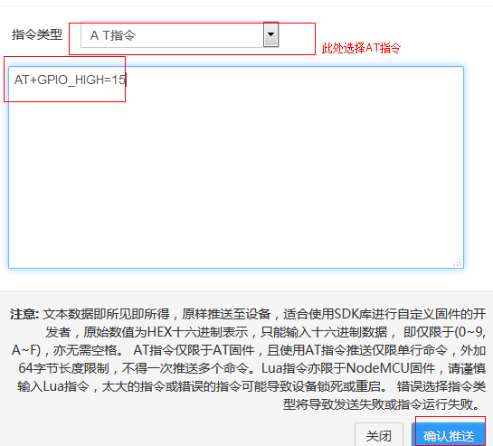

#使用AT固件
- 注册平台账号，前往[此处](http://211.155.86.145:8000/web/register/)注册账号并登入，点击“[设备类别](http://211.155.86.145:8000/web/apps/)”，并新增一个APP，记录新APP的APPID与APPKEY，稍后使用。
- 按如下步骤，下载AT固件，自己编译或使用预编译的版本，并刷入板子。固件刷入工具最好使用乐鑫推荐的[Flash Download Tool](http://bbs.espressif.com/viewtopic.php?f=5&t=433)。

```
#使用以下命令编译AT固件
git clone https://github.com/pushdotccgzs/espush_at.git
cd espush_at
make clean && make
#或者直接使用bin目录下以预编译
bin/eagle.flash.bin	0x00000
bin/eagle.irom0text.bin	0x40000
bin/blank.bin	0x7E000
```
刷入时截图如下：


- 开启调试控制台，默认波特率BIT_RATE_115200，按以下方式输入指令：
```
//注解，以下以 「>」开头的为输入行，已「<」开头的为输出行，其余为注解;
//AT 命令测试
>AT
<OK

//切换为STATION模式
>AT+CWMODE=1
<OK

//请配置为正确的SSID与密码，并能连入网络。
>AT+CWJAP="OUR_SSID","PWD_SSID"
<OK

//查询网络连接状态
>AT+CIPSTA?
<+CIPSTA:"192.168.0.102"
<OK

//查看推送状态
>AT+PUSH?
<3
<OK

//以下请替换为你自己添加的APPID与APPKEY,不要引号，直接输入即可, 这里请注意是APPID，非APPNAME，数字的，第一栏的APPID
>AT+PUSH_DEF=APPID,APPKEY
<OK

//若过较长时间仍一直返回3，则无法连接到服务器，请AT+RST后重试
>AT+PUSH?
<2
<OK

//收到来自远端的数据。
+MSG,20:HELLO，FROM PUSHMSG.
```
- 在平台[在线设备](http://211.155.86.145:8000/web/devices/)、[数据推送](http://211.155.86.145:8000/web/pushmsg/)等处，均可向设备发送指令，指令将从串口传出。

#AT指令说明
AT-PUSH固件新增了3个命令，以下做简要说明
- AT+PUSH，使用AT+PUSH?可查询当前连接状态，返回值定义为：
```
CONNECTING = 0
DNS_LOOKUP = 1
CONNECTED = 2
DISCONNECTED = 3
```
留意只有返回值为 `2` 时才代表已连接，其余都是未连接状态，如连接中，DNS查找中，已断开等。

- `AT+PUSH_DEF=APPID,APPKEY`可连入ES-PUSH系统。命令为异步式，敲入后立即返回，并将推送APP信息包括ID于KEY保存在flash中，下次启动且进入station模式后，将自动连接平台。APPID与APPKEY均不需要输入引号，直接键入即可，如` AT+PUSH_DEF=123134,25b28f0ffb9711e4a96d4341579b49a1`，且后面不得跟随多余的空格或其他可见或不可见字符。此条为无效的示例命令，照抄不会连入平台。

- `AT+PUSH_CUR=APPID,APPKEY`可连入ES-PUSH系统，与`AT+PUSH_DEF`类似，但不同的是并不会保存推送连接信息，下次启动后需要重新设置。

可随时使用AT+PUSH?查询连接状态，当处于可连接时，能使用如下命令。
- AT+PUSHMSG，数据推送，距离推送HELLO字符串到服务器可发送指令`AT+PUSHMSG=HELLO`即可。在与服务器正常连接的情况下返回OK，否则返回ERROR。

- AT+UNPUSH，使用此命令断开与服务器的连接，断开后服务端也将无法推送数据到终端。返回OK。
- +MSG，收到数据后，模块将向串口写入以下数据，数据已`+MSG %d:`开头，其中%d为
- AT+GPIO_LOW=N ，使用此指令控制指定GPIO口的低电平，可远程使用此命令。
- AT+GPIO_HIGH=N，同上，使用此命令控制GPIO口的高电平，可远程使用。可控制的GPIO口参考如下：
```C
//0 ~ 5
{0, FUNC_GPIO0, PERIPHS_IO_MUX_GPIO0_U},
{1, FUNC_GPIO1, PERIPHS_IO_MUX_U0TXD_U},  //串口tx口，请不要使用
{2, FUNC_GPIO2, PERIPHS_IO_MUX_GPIO2_U},
{3, FUNC_GPIO3, PERIPHS_IO_MUX_U0RXD_U},  //串口RX口，请不要使用
{4, FUNC_GPIO4, PERIPHS_IO_MUX_GPIO4_U},
{5, FUNC_GPIO5, PERIPHS_IO_MUX_GPIO5_U},
//9 ~ 10
{9, FUNC_GPIO9, PERIPHS_IO_MUX_SD_DATA2_U},
{10, FUNC_GPIO10, PERIPHS_IO_MUX_SD_DATA3_U},
//12~15
{12, FUNC_GPIO12, PERIPHS_IO_MUX_MTDI_U},
{13, FUNC_GPIO13, PERIPHS_IO_MUX_MTCK_U},
{14, FUNC_GPIO14, PERIPHS_IO_MUX_MTMS_U},
{15, FUNC_GPIO15, PERIPHS_IO_MUX_MTDO_U},
```

使用范例及方式见下图




#固件编译及源码说明
运行`git clone https://github.com/pushdotccgzs/espush_at.git`，克隆AT固件源码库，此源码fork自[乐鑫官方AT固件](http://bbs.espressif.com/viewtopic.php?f=5&t=481)，并在此基础上增加了用于推送的命令，具体可见源码`app/user/at_push.c`。执行`make`即可编译，若需要使用云端推送升级功能，需要使用大于512KB的Flash，见官方的[说明](http://bbs.espressif.com/viewtopic.php?f=5&t=481)：
```
AT_v0.24 Release Note:
注意：运行 AT 固件，支持云端升级，请使用 1024KB 或以上容量的 flash
```

定制其他命令可简单在`user_main.c`中的`at_custom_cmd`数组中新增即可。


